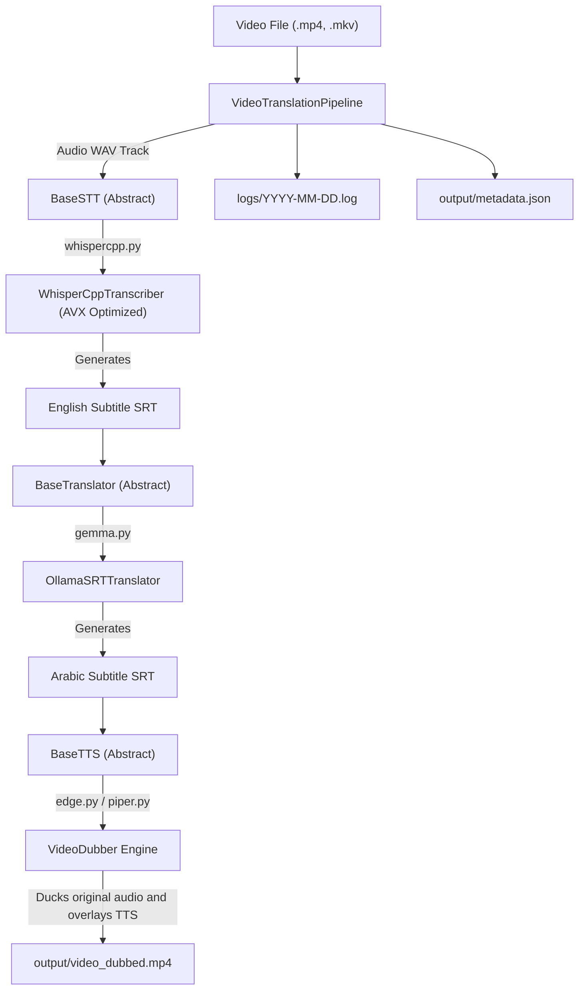

# System Architecture

The AlZeini Smart Video Translator architecture decouples speech recognition, LLM translation, and audio voiceover providers through abstract base contracts.

---

## 🏗️ Technical Architecture Diagram



---

## 🔌 Decoupled Interface Contracts

To prevent tight coupling, the pipeline communicates with processing engines solely through abstract classes:

### Base STT Interface (`BaseSTT`)
Located in **[base.py](file:///home/mohamed-al-zeini/Documents/AI-Projects/AlZeini_Smart_Video_Translator/alzeini_video_translator/stt/base.py)**:
```python
class BaseSTT:
    def transcribe(self, wav_path, srt_prefix):
        raise NotImplementedError()
```

### Base Translator Interface (`BaseTranslator`)
Located in **[base.py](file:///home/mohamed-al-zeini/Documents/AI-Projects/AlZeini_Smart_Video_Translator/alzeini_video_translator/translation/base.py)**:
```python
class BaseTranslator:
    def translate_srt(self, input_srt_path, output_srt_path, batch_size=20):
        raise NotImplementedError()
```

### Base TTS Interface (`BaseTTS`)
Located in **[base.py](file:///home/mohamed-al-zeini/Documents/AI-Projects/AlZeini_Smart_Video_Translator/alzeini_video_translator/tts/base.py)**:
```python
class BaseTTS:
    def generate_speech(self, text, output_path):
        raise NotImplementedError()
```

---

## 📦 Directory Structure

```text
AlZeini_Smart_Video_Translator/
├── alzeini_video_translator/    # Core Library Package
│   ├── core/                    # pipeline.py, config.py
│   ├── stt/                     # base.py, whispercpp.py
│   ├── translation/             # base.py, gemma.py
│   └── tts/                     # base.py, edge.py, pyttsx3.py, piper.py, voiceover.py
├── models/                      # Central Model Weight Storage (Git Ignored)
├── output/                      # Structured Output Folder (Git Ignored)
├── logs/                        # Running log files (Git Ignored)
├── app.py                       # CLI Wrapper Entrypoint
└── config.yaml                  # Global Configuration Parameters
```
