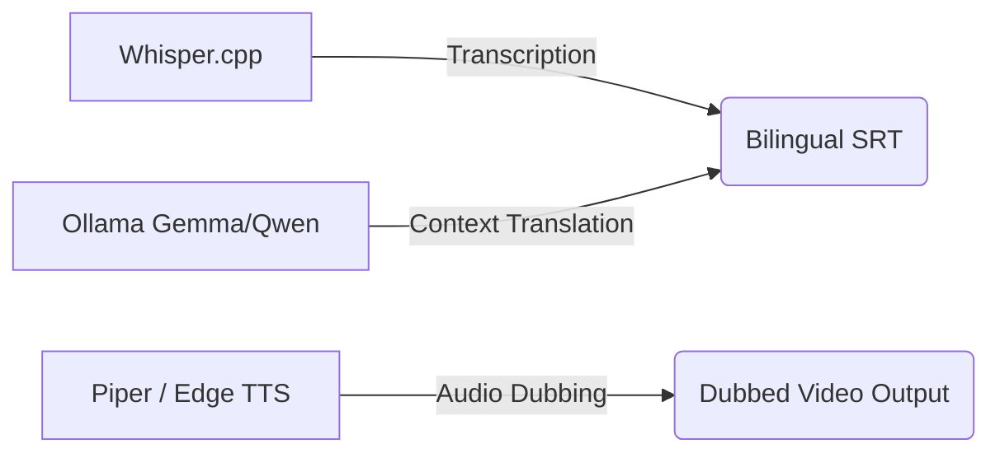

# 🎬 AlZeini Smart Video Translator

### Offline AI-Powered Video Transcription & Dubbing Platform

---

Welcome to the official documentation for **AlZeini Smart Video Translator**, a modular, local-first platform designed to transcribe, translate, and dub video files completely offline. 

By combining C++ speech models, local LLMs, and high-quality voice synthesis engines, it compiles foreign language videos (lectures, tutorials, and courses) into natural, dubbed Arabic videos—with no internet required and 100% free!

---

## 🌟 Key Pillars

* **Offline First**: All processing runs locally on your computer. Your files and data never leave your machine.
* **GPU-Free Execution**: Optimized C++ binaries utilizing CPU instruction sets (AVX/AVX2) run efficiently even on laptops.
* **Decoupled Architecture**: Designed with clean interface boundaries (`BaseSTT`, `BaseTranslator`, `BaseTTS`) allowing you to hot-swap models, voices, and engines at runtime.
* **Bilingual Subtitles**: Generates stacked English and Arabic subtitle lines, serving as an exceptional tool for language acquisition and study.
* **Intelligent Audio Mix**: Implements professional audio ducking filters, lowering original vocals to 20% to keep background atmosphere while overlaying clear voiceover streams.

---

## 🚀 Quick Navigation

* Get started in minutes by visiting the [🚀 Quick Start](quickstart.md) guide.
* View the system setup commands in [💻 Installation](installation.md).
* Review model speed and size statistics in [📊 Benchmarks](benchmarks.md).
* Learn how to extend the framework in [🤝 Contributing](contributing.md).
