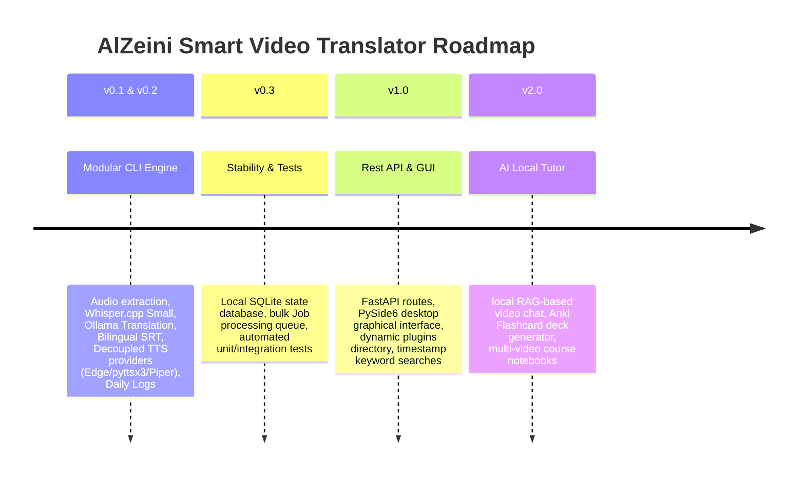

# Roadmap & Release Phases

Follow the planned progression stages for the AlZeini Smart Video Translator platform.

---

## 🗺️ Timeline Phases

---

## 📋 Phase Details

### 🟢 Version 0.2.x (Current Stable Beta)
- Modular framework structure (`alzeini_video_translator`).
- Optimized `ggml-small.bin` speech recognition.
- Context-preserved batch translation using local LLMs.
- Dual bilingual subtitle mapping.
- Audio ducking mixes and track replacements.
- Structured daily log files.
- pip package bindings (`azvt` CLI).

### 🟡 Version 0.3.x (Next Milestone)
- **Job Processing Queue**: Process list of video files sequentially overnight.
- **SQLite Database**: Log session metadata, glossary vocabulary tables, and translation cache states.
- **Enhanced Testing**: Setup robust unit tests for translation parser filters.

### 🔴 Version 1.0.0 (Release Candidate)
- **FastAPI Endpoints**: Run processing endpoints (`/translate`, `/status`, `/ocr`) over HTTP.
- **PySide6 Graphical Interface**: Choose files, preview progress bars, and toggle configurations from a desktop GUI window.
- **Keyword Search**: Index transcripts to search keywords and jump to exact timestamps.

### 🟣 Version 2.0.0 (Semantic Knowledge Platform)
- **AI Tutor RAG Chat**: Chat with your local video library, query terms, and jump to where the answers are spoken.
- **Anki Exporter**: Push vocabulary booklets directly to Anki deck files (`.apkg`) for flashcard study.
